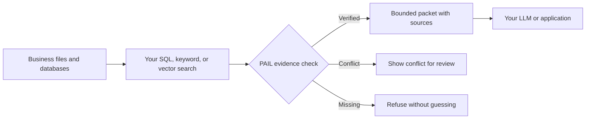

# PAIL: check the evidence before AI answers

**PAIL is a safety checkpoint for record-based RAG.** Your search finds possible
records. PAIL checks whether they belong to the same customer, payment, order,
case, or incident before an LLM receives them.

[](https://github.com/RaushanRoyBihar/pail-developer-preview/actions/workflows/public-safety.yml)
[](https://ancient-intelligence-lab.kakarotvira06.workers.dev/lab)
[](https://ancient-intelligence-lab.kakarotvira06.workers.dev/developers)

## The problem in one example

A support assistant searches for transaction `TXN-0025`:

```text
CRM record:      TXN-0025 -> customer CUST-125
Payment record:  TXN-0025 -> customer CUST-999
```

Both rows are relevant. They cannot both establish the same customer. Ordinary
RAG may rank one above the other; PAIL returns `CONFLICT_WITHHELD` and prevents
the model from silently choosing.

## Three clear outcomes

| PAIL decision | Plain meaning | May an LLM answer? |
|---|---|---:|
| `VERIFIED_PACKET` | The required records and relations agree | Yes, from the packet |
| `CONFLICT_WITHHELD` | Protected fields disagree across sources | No |
| `NO_VERIFIED_EVIDENCE` | The requested proof is absent | No |

## Where PAIL fits



PAIL complements LangChain, LlamaIndex, SQL, FTS, vector databases, and local or
hosted models. It is not another universal retriever, database, or language
model.

## Try it

1. [Run the browser demo](https://ancient-intelligence-lab.kakarotvira06.workers.dev/lab).
2. Choose a verified, conflict, or missing-evidence example.
3. Inspect what PAIL releases and why it stops.
4. [Open the local evaluator guide](https://ancient-intelligence-lab.kakarotvira06.workers.dev/developers#local-runtime) when you are ready to use sanitized files on your machine.

The browser demo uses synthetic records. It does not contain or expose the
private grammar rules, relation policy, acoustic research, indexes, or learned
state.

## Public developer boundary

This repository contains:

- stable HTTP request and response contracts;
- dependency-free Python and JavaScript clients;
- synthetic fixtures and reproducible public benchmark summaries;
- SutraFlow syntax and non-executable examples;
- CI checks that reject archives, databases, secrets, and private runtime paths.

This repository deliberately does **not** contain:

- executable grammar and relation-guard rules;
- private parser, compiler, ranking, or compression implementation;
- acoustic fingerprint construction or frequency maps;
- trained/adaptive memory, private datasets, credentials, or indexes.

The public client calls a separately deployed PAIL runtime. This repository by
itself does not reproduce the private evidence firewall.

## Measured release evidence

| Controlled synthetic workload | Observed result |
|---|---:|
| Cross-source POS records | 4,027 |
| Expected verified/conflict/missing outcomes | 140 / 140 |
| Retrieved instruction quarantine sample | 7 / 7 |
| Exact/separator-drift relation campaign | 500 / 500 |

These are local synthetic regression results. They are not PhonePe or bank
data, an independent security audit, customer accuracy, or production-capacity
proof. Read the [benchmark boundary](docs/BENCHMARK.md) before citing them.

## Client example

```python
from clients.python.pail_client import PailClient

client = PailClient("https://your-pail-gateway.example")
result = client.query(
    corpus_id="0123456789abcdef0123456789abcdef",
    query="Verify trace_id=TRACE-9001 and request_id=REQ-9001",
)

if result["decision"] == "VERIFIED_PACKET":
    send_to_your_llm(result["packet"])
else:
    show_conflict_or_refusal(result)
```

JavaScript users can start with [`clients/js/pail-client.mjs`](clients/js/pail-client.mjs).
See the [API contract](docs/API.md), [architecture](docs/ARCHITECTURE.md),
[claim boundary](docs/CLAIM_BOUNDARY.md), and [SutraFlow preview](docs/SUTRAFLOW.md).

## Status and contact

PAIL is a research/developer prototype ready for controlled evaluation. It is
not yet independently certified or supported by a production SLA.

- Laboratory: https://ancient-intelligence-lab.kakarotvira06.workers.dev/
- Email: [kakarotvira06@gmail.com](mailto:kakarotvira06@gmail.com)
- WhatsApp: [+91 91413 86853](https://wa.me/919141386853)
- WhatsApp: [+91 80928 39259](https://wa.me/918092839259)
